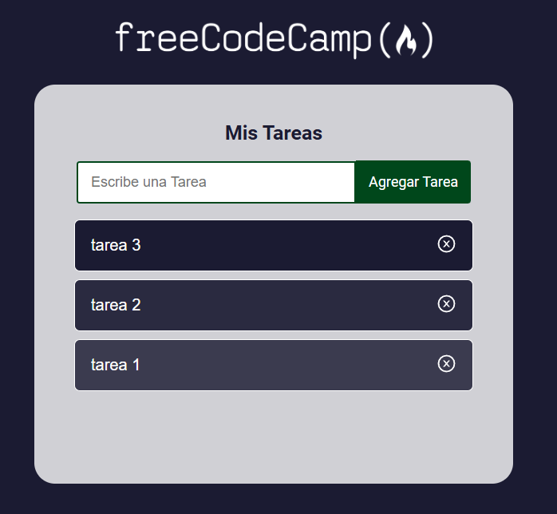

# Aplicación de tareas

La funcionalidad de esta aplicación es escribir tareas; el usuario podrá ingresar una tarea y agregarla a una lista, podrá colocar varias tareas que se irán colocando de forma vertical, estas tareas al dar clic sobre cada una de ellas se tacharan para mostrar que la tarea fue completada y si se quiere también eliminarlas.

Con este proyecto se logró aprender a crear componentes, utilizar iconos de React-icons, operador ternario, pasar funciones como props, utilizar hooks como el useState y funcionamiento de un formulario.

## Ejecutar el proyecto

1. Ya que el proyecto contien dependencias para su funcionamiento, lo primero sería instalar las biblitecas requeridas con el siguiente comando `npm install`
2. En el archivo `package.json` se encuentran los scripts para la ejecución del proyecto. Usaremos el script `npm start`
3. La aplicación se ejecutará en la dirección [http://localhost:3000](http://localhost:3000)
4. En el navegador de su preferencia vaya a la ruta indicada y podrá ver la aplicación

## Tareas por hacer

1. Actualizar el proyecto para que use Vite (create-react-app ya está descontinuado)
2. Actualizar el proyecto para que use Tipescript
3. Actualizar el proyecto para que use Tailwind Css
4. Hacer que las tareas se guarden en el local storage
